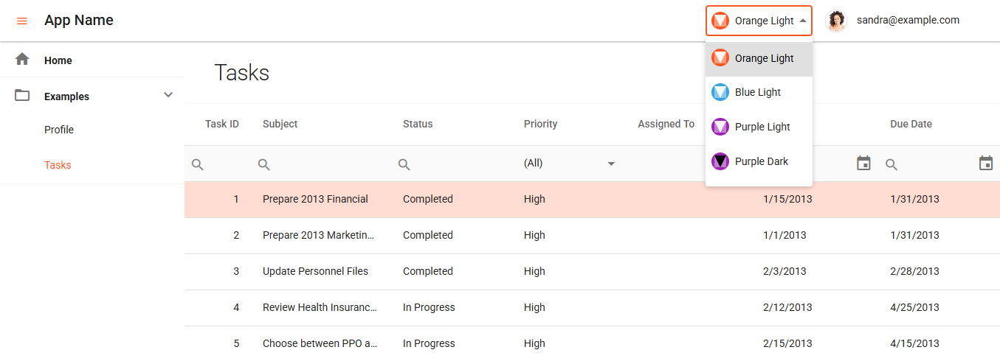

<!-- default badges list -->
[](https://supportcenter.devexpress.com/ticket/details/T1109715)
[](https://docs.devexpress.com/GeneralInformation/403183)
[](#does-this-example-address-your-development-requirementsobjectives)
<!-- default badges end -->

# Theme Switcher for DevExtreme - How to implement Theme Selector for the DevExtreme Project Template

This example illustrates how to switch between themes in our Project Template at runtime. We added the [SelectBox](https://js.devexpress.com/Documentation/ApiReference/UI_Components/dxSelectBox/) with the theme list to switch between themes.

The DevExtreme Project Template has two default themes: `base` and `swatch`. Also, the template has several places where the SCSS variables used to change colors.
The switching routine consists of three steps:
1) Use the StyleSheet API to disable all loaded `base` theme stylesheets links excluding the active one.
2) Use the StyleSheet API to disable all loaded `swatch` stylesheet links keeping the active one.
3) Update SCSS variables.

See its implementation in the following files:
- [Angular Theme Service](Angular/src/app/shared/services/theme.service.ts)
- [Vue Theme Service](Vue/src/services/theme-service.ts)
- [React Theme Service](React/src/contexts/theme.tsx)

The default Project Template also has several elements that don't apply theme CSS rules (font color, background color) automatically. For these elements, you can use our predefined [CSS classes](https://js.devexpress.com/Documentation/ApiReference/UI_Components/CSS_Classes/):

- [dx-theme-background-color](https://js.devexpress.com/Documentation/ApiReference/UI_Components/CSS_Classes/#dx-theme-background-color)
- [dx-theme-text-color](https://js.devexpress.com/Documentation/ApiReference/UI_Components/CSS_Classes/#dx-theme-text-color)

### How to add a theme
1) Add JSON meta data file for the required theme to `src/themes` directory. The following help topic describes the file's format: [Export Theme Metadata](https://js.devexpress.com/React/Documentation/Guide/Common/DevExtreme_CLI/#ThemeBuilder/Export_Theme_Metadata). You can duplicate an existing JSON file and change its **baseTheme** value.
2) Add this file to the command list in the **devextreme.json** file. The **devextreme.json** file lists themes to build. By default, it includes 4 base themes and 2 swatch themes.
3) Run the `npm run build-themes` command. Our **ThemeBuilder CLI** reads metadata listed in **devextreme.json** and build themes. Find built themes in the directory specified in **devextreme.json** as `outputFile`.
4) Add a link to the new theme in **index.html**.
5) Add a new entry to the array in the theme service's **getThemeData** function. This array is the data source for the SelectBox theme-selector. This step is required only for base themes.

Currently, there are two swatch themes: light and dark. If you want to switch between three or more swatch themes, extend the **applySwatchTheme** method in the theme service.


It is possible to generate a theme file directly using our [ThemeBuilder CLI](https://js.devexpress.com/Documentation/Guide/Common/DevExtreme_CLI/#ThemeBuilder). For example, the following commands generate light and dark swatch themes:
```
npx devextreme-cli build-theme --base-theme="material.blue.light" --output-file="theme.additional.light" --make-swatch --assetsBasePath="../../../node_modules/devextreme/dist/css" --output-color-scheme="additional"

npx devextreme-cli build-theme --base-theme="material.blue.dark" --output-file="theme.additional.dark" --make-swatch --assetsBasePath="../../../node_modules/devextreme/dist/css" --output-color-scheme="additional"
```

<div align="center"></div>

## Files to Review

- **Angular**
    - [index.html](Angular/src/index.html)
    - [app.component.ts](Angular/src/app/app.component.ts)
    - [app.component.html](Angular/src/app/app.component.html)
    - [theme.service.ts](Angular/src/app/shared/services/theme.service.ts)
    - [theme-selector.component.ts](Angular/src/app/shared/components/theme-selector/theme-selector.component.ts)
    - [theme-selector.component.html](Angular/src/app/shared/components/theme-selector/theme-selector.component.html)
    - [variables.base.scss](Angular/src/themes/variables.base.scss)
    - [variables.additional.scss](Angular/src/themes/variables.additional.scss)
    - [angular.json](Angular/angular.json)
 - **Vue**
    - [App.vue](Vue/src/App.vue)
    - [theme-service.ts](Vue/src/services/theme-service.ts)
    - [theme-selector.vue](Vue/src/components/theme-selector.vue)
    - [main.ts](Vue/src/main.ts)
    - [variables.base.scss](Vue/src/themes/variables.base.scss)
    - [variables.additional.scss](Vue/src/themes/variables.additional.scss)
    - [public](Vue/public)
 - **React**
    - [App.tsx](React/src/App.tsx)
    - [variables.base.scss](React/src/themes/variables.base.scss)
    - [variables.additional.scss](React/src/themes/variables.additional.scss)
    - [theme-constants.ts](React/src/utils/theme-constants.ts)
    - [theme.tsx](React/src/contexts/theme.tsx)
    - [ThemeSelector.tsx](React/src/components/theme-selector/ThemeSelector.tsx)
    - [public](React/public/)


## Documentation

- [Predefined Themes](https://js.devexpress.com/Documentation/Guide/Themes_and_Styles/Predefined_Themes/)
- [Project Template - Configure Themes](https://js.devexpress.com/Documentation/Guide/Angular_Components/Application_Template/#Configure_Themes)
<!-- feedback -->
## Does this example address your development requirements/objectives?

[](https://www.devexpress.com/support/examples/survey.xml?utm_source=github&utm_campaign=devextreme-project-template-theme-selector&~~~was_helpful=yes) [](https://www.devexpress.com/support/examples/survey.xml?utm_source=github&utm_campaign=devextreme-project-template-theme-selector&~~~was_helpful=no)

(you will be redirected to DevExpress.com to submit your response)
<!-- feedback end -->
