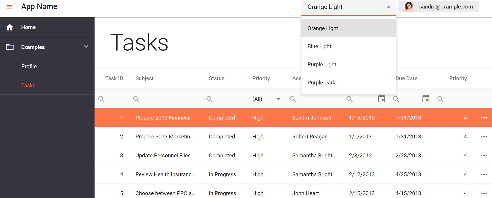

<!-- default badges list -->

[](https://supportcenter.devexpress.com/ticket/details/T1109715)
[](https://docs.devexpress.com/GeneralInformation/403183)
<!-- default badges end -->

# Theme Switcher for DevExtreme - How to implement Theme Selector for the DevExtreme Project Template

The DevExtreme Project Template has two default themes: `base` and `swatch`. You can change the base theme to another Material theme at runtime. To switch between themes, use the StyleSheet API. For this, disable all loaded theme stylesheet links excluding the active one. 

The DevExtreme Project Template has several places where the SCSS variables used to change the color. To have the same color as main theme we use CSS variables and change them.

This sample demonstrates how to do this via a drop-down editor ([SelectBox](https://js.devexpress.com/Documentation/ApiReference/UI_Components/dxSelectBox/)) located in a header ([Toolbar](https://js.devexpress.com/Documentation/ApiReference/UI_Components/dxToolbar/)). The default Project Template also has several elements that don't apply theme CSS rules (font color, background color) automatically. For these elements, you can use our predefined [CSS classes](https://js.devexpress.com/Documentation/ApiReference/UI_Components/CSS_Classes/):

- [dx-theme-background-color](https://js.devexpress.com/Documentation/ApiReference/UI_Components/CSS_Classes/#dx-theme-background-color)
- [dx-theme-text-color](https://js.devexpress.com/Documentation/ApiReference/UI_Components/CSS_Classes/#dx-theme-text-color)

To generate swatch themes you can use ThemeBuilder CLI:

```
npx devextreme-cli build-theme --base-theme="material.blue.light" --output-file="theme.additional.light" --make-swatch --assetsBasePath="../../../node_modules/devextreme/dist/css" --output-color-scheme="additional"

npx devextreme-cli build-theme --base-theme="material.blue.dark" --output-file="theme.additional.dark" --make-swatch --assetsBasePath="../../../node_modules/devextreme/dist/css" --output-color-scheme="additional"
```

<div align="center"></div>

## Files to Review

- **Angular**
    - [index.html](angular/src/index.html)
    - [theme.service.ts](angular/src/app/shared/services/theme.service.ts)
    - [theme-selector.component.ts](angular/src/app/shared/components/theme-selector/theme-selector.component.ts)
    - [theme-selector.component.html](angular/src/app/shared/components/theme-selector/theme-selector.component.html)
    - [app.component.ts](angular/src/app/app.component.ts)
    - [variables.css](angular/src/themes/generated/variables.css)
    - [variables.base.scss](angular/src/themes/generated/variables.base.scss)
    - [variables.additional.scss](angular/src/themes/generated/variables.additional.scss)
    - [angular.json](angular/angular.json)
 - **Vue**
    - [theme-service.js](vue/src/services/theme-service.js)
    - [App.vue](vue/src/App.vue)
    - [theme-selector.vue](vue/src/components/theme-selector.vue)
    - [main.js](vue/src/main.js)
    - [variables.css](vue/src/themes/generated/variables.css)
    - [variables.base.scss](vue/src/themes/generated/variables.base.scss)
    - [variables.additional.scss](vue/src/themes/generated/variables.additional.scss)
    - [public](vue/public)
 - **React**
    - [App.js](react/src/App.js)
    - [variables.css](react/src/themes/generated/variables.css)
    - [variables.base.scss](react/src/themes/generated/variables.base.scss)
    - [variables.additional.scss](react/src/themes/generated/variables.additional.scss)
    - [theme-constants.js](react/src/utils/theme-constants.js)
    - [theme.js](react/src/contexts/theme.js)
    - [ThemeSelector.js](react/src/components/theme-selector/ThemeSelector.js)
    - [public](react/public/)


## Documentation

- [Predefined Themes](https://js.devexpress.com/Documentation/Guide/Themes_and_Styles/Predefined_Themes/)
- [Project Template - Configure Themes](https://js.devexpress.com/Documentation/Guide/Angular_Components/Application_Template/#Configure_Themes)
